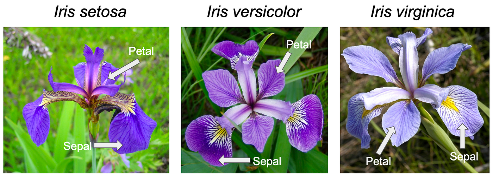

```{css, echo=FALSE}
/* CSS code to style the HTML*/

h1 
{
  font-size: 28px;
}

hr 
{
  border: none;
  border-top: 3px dashed #3B1E54;
  color: #3B1E54;
  background-color: #CDC1FF;
  height: 1px;
  margin: 20px 0;
}

body
{
  background: #CDC1FF;
  color: #3B1E54
}

table
{
  padding: 10px 0px
  border: 2px solid #333;
  border-collapse: collapse;
}

img 
{
  display: block;         /* Make the image a block element */
  margin-left: auto;     /* Automatically adjust left margin */
  margin-right: auto;    /* Automatically adjust right margin */
  border: 2px solid #333;
pre
{
  background-color: #EEEEEE;
  border: 2px solid #333;
}
```

```{r Importing the iris dataset and other libraries, echo=FALSE, message=FALSE, warning=FALSE}
iris <- read.csv(".\\dataset\\Iris.csv")
library(tidyverse)
library(psych)
library(devtools)
install_github("vqv/ggbiplot")
library(ggbiplot)
library(factoextra)
library(nnet)
library(caret)
```


***
# 🌸**Principal component analysis (PCA) Analysis on Iris Dataset**🌸
***

#### **By: Shourish Kothawale & Rafael Prignano**
***

## **1. Introduction and Problem Statement**
***

Originally derived from the name of the Greek goddess of the rainbow, the Iris flower known for it's beautiful, vibrant color and intricate petal formations create an immense genus of flowering plants. This in time would be mirrored into a dataset created by British statistician Ronald Fisher in 1936. Fisher's dataset would later to go on to become an essential cornerstone in the field of data science and machine learning. The iris dataset consists of approximately 150 observations of iris flowers defined by three species:

* **Iris Setosa**
* **Iris Versicolor**
* **Iris Virginica**

These 3 species are represented by physical traits summed into 4 categories, sepal length, sepal width, petal length, and petal width (measured in cm). Petal and sepal structure help provide distinct information to differ from each species. Created by Fisher as a purpose to showcase linear discriminant analysis (LDA), a method to separate classes appropriately.

Fisher's dataset has increased in popularity tenfold overtime for many reasons alike, simplicity, classes that are balanced, linearly separable nature, and being extremely beginner friendly. Relevant to 466 & 566, the Iris dataset makes an excellent catalyst illustrating statistical and visualization in RStudio. 

### **1.1 Problem Statement**
***
Analyzing datasets with numerous variables, it is essential to acknowledge the high correlations and redundancy among variables to provide a better insight in analysis. PCA helps by reducing the number of numeric variables while minimizing loss of data or information, transforming variables with correlation in smaller sets that are not correlated, as well as mitigating multicollinearity which can create accurate statistical analysis.

The purpose of this project is to apply PCA to the Iris dataset and illustrate it's ability to simplify high dimensional data while keeping the integrity of the original key patterns and change. With the help of visualizing and analyzing the results of principal components, we can discover potential relationships underlying in the data and reveal distinct characteristics of the Iris species provided. 

### **1.2 Principal Component Analysis (PCA) Overview**
***
Working with datasets that contain numerous variables, its likely to come across features that share high correlation. This is can defined as multicollinearity. Multicollinearity can make analyzing & visualizing data difficult. A powerful technique, Principal Component Analysis. PCA reduces the number of variables by turning them into a smaller set of variables that would no longer share correlation defined as principal components. 

* PCA structure: Illustrates the data onto a coordinate system, where the first principal component (PC1) captures which part of the dataset shares the most variability. Each specific sub-component (PC2) keeps the remaining variance. After this process, the transformation will create a clearer visualization & analysis. PCA is extremely useful for datasets with extreme magnitude. 

<br>
<figure>
  
  <br>
  <center><figcaption>Figure 1: An Iris flower</figcaption><center>
</figure>
<br>

Principal Component Analysis (PCA) is a technique commonly used in Exploratory Data Analysis (EDA) to reduce the dimensionality of datasets while retaining as much variance as possible. Below are the key concepts and formulas involved.

### **1.3 PCA Formulas**
***

The principal components (PCs) are linear combinations of the original variables \(X_1, X_2, \dots, X_m\). For a dataset with \(m\) variables:

$$
PC_1 = \beta_{10} + \beta_{11}X_1 + \beta_{12}X_2 + \beta_{13}X_3 + \cdots + \beta_{1m}X_m
$$

$$
PC_2 = \beta_{20} + \beta_{21}X_1 + \beta_{22}X_2 + \beta_{23}X_3 + \cdots + \beta_{2m}X_m
$$

$$
\vdots
$$

$$
PC_m = \beta_{m0} + \beta_{m1}X_1 + \beta_{m2}X_2 + \beta_{m3}X_3 + \cdots + \beta_{mm}X_m
$$

- \(PC_1\) captures the maximum variance in the dataset.
- \(PC_2\) captures the next largest variance, ensuring no correlation with \(PC_1\).
- Subsequent PCs follow the same pattern, with each capturing the remaining variance and being uncorrelated with all previous PCs.

### **1.4 Key Properties of PCA**
***

1. **Orthogonality:** All principal components are uncorrelated (orthogonal) to one another.  
   **Example:** The correlation between \(PC_1\) and \(PC_2\) is zero.

2. **Maximizing Variance:** The coefficients \(\beta_{ij}\) are determined to maximize the variance captured by each PC. This PC has the property of orthogonality to PC1. Consequently, it also stays orthogonal to any other vectors added, since the algoritm tries to find vectors orthogonal to every other vector.

PCA is also used for clustering by reducing high-dimensional data into a few principal components that capture the most variance, simplifying the dataset and highlighting key patterns. This transformation enhances visual clarity, reduces noise, and eliminates multicollinearity, enabling clustering algorithms to identify distinct groups more effectively.

## **2. Data set Summary**
***

In this section, we provide a comprehensive summary and description of the Iris dataset to gain a foundation understanding of its structure and content.

To better understand this dataset, we explore these features individually to examine the distributions and ranges within each species. This process involves looking at observations (or rows), which correspond to individual flowers, and allows us to identify patterns and variances in the measurements across species.

Additionally, we analyze the dataset's metadata to examine the data types of each column and better understand the dataset's structure. This step is essential for validating the integrity of the data, ensuring that each feature is stored in a format that allows for accurate analysis.

Furthermore, we delve into statistical descriptors such as the mean, median, standard deviation, minimum, and maximum values for each feature. These descriptors provide valuable insights into the overall distribution of the data, revealing tendencies within each species, identifying potential outliers, and highlighting differences between the three iris species.

### **2.1 Importing and understanding the dataset**
***

We must start of this project by importing the dataset. In the project's folder their exists a file called "Iris.csv", this file contains all the 150 observations done by Robert A. Fisher. We have pulled this dataset from Kaggle, the title for the dataset is "<a href="https://www.kaggle.com/datasets/uciml/iris">Iris Species</a>", and originally belongs to UC Irvine Machine Learning (UCIML) Repository. We import the dataset by the following code:

Here we have imported the iris dataset in to the iris data variable, we can further check the type of iris by using the iris function. Note there are more ways to import the dataset, we have used a download csv here, other way is to include through an url. We can clearly see from below that the iris dataset is of the data frame data structure.

```{r checking iris variable type}
  class(iris)
```

Now we explore into the data set by observing information placed in the head and tail of the dataset.

```{r checking head and tail}
  head(iris)
  tail(iris)
```

Through this we can already see that there are 5 data columns, and 1 column that represents the index number for a particular observation that is "Id". The "Id" column is insignificant for analyzing the relations between two variables, but still gives us the understanding about how many rows exist in the data. Lets formally validate that the observation and feature count are consitent with our understanding.

```{r checking count of rows and columns}
  paste("Number of columns: ",ncol(iris))
  paste("Number of rows: ",nrow(iris))
```

We can now confim that there are indeed 150 observations in the dataset. There are 6 variables here, as discussed above the id column is only used for indexing, so there are 5 columns that matter to us validating that observation too. To observe the datatypes of the columns we can simply convert our data.frame to a tibble. A tibble is a modernized data.frame (according to <a href="https://tibble.tidyverse.org/">tidyverse</a>), that works similarly to a data.frame but has additional features. One additional feature that will help us is that the tibble display the datatypes of each column above their respective column headers, so we will not have to check for each columns datatype individually.

```{r tibble and datatypes}
  iris <- as_tibble(iris)
  head(iris)
```

We can observe that the "Id" is an <int> or integer, the 4 physical features of the Iris are <dbl> or doubles according to tibbles, one can simply think about them as double-precision floating point numerics. Finally the target variable (a.k.a the label) is of type <chr> or character. This represents the type of flower the particular observation represents.

Note that since this is a very popular and small datasets the data in it is already clean, this means that the data has a low amount of errors and that it has no missing values. It is highly recommended that with any dataset one must always explore the data and get familiar with the dataset, and take appropriate measures to clean the data.

### **2.2 Five Number Summary and more**
***

We will now use the `summary()` function of data.frame to get more understating about the distribution of our data, this will give us the five-number summary for the quantitative variables and counts of the categorical variables. We will be excluding the id column here since it is insignificant.

```{r five number summary and more}
  summary(iris[, -c(1)])
```

This summary shows us the statics for each of the physical feature. The statistics include the minimum and maximum values from the columns, along with their central tendancies in the form of mean and median, we also get the Interquartile range (IQR) for each feature. The IQRs help us understand how the data is clustered and can also hep us identify outliers. Outliers are often data points that fall below Q1 - 1.5/IQR or above Q3 + 1.5/IQR. Also, the frequencies of the categorical variables are displayed for them.

<figure>
  
  <br>
  <center><figcaption>Figure 2: The features of the Iris Flower</figcaption><center>
</figure>

## **3. Exploratory Data Analysis (EDA)**
***

In this section, we will analyze the relationships between the variables in the Iris dataset by plotting scatterplots. Scatterplots are a fundamental visualization tool in data analysis, offering an intuitive way to examine potential correlations between pairs of variables. By plotting the data points for each pair of variables, we can directly observe patterns, trends, and possible associations, providing insight into the nature of the relationships within the dataset.

Each scatterplot will display one pair of variables on the x- and y-axes, with individual points representing observations of iris flowers. These visualizations will allow us to assess whether there is a positive correlation (where both variables increase together), a negative correlation (where one variable increases as the other decreases), or no correlation (where there is no apparent relationship between the two variables). Scatterplots also allow us to identify clusters or groups in the data and highlight any potential outliers, which could indicate interesting patterns or anomalies in the dataset.

We will further enhance our scatterplots by coloring or shaping points according to the species of the iris flower (e.g., Iris setosa, Iris versicolor, Iris virginica). This approach will help us observe if the relationship between variables is consistent across different species or if it varies significantly. For instance, certain species may exhibit stronger correlations between specific measurements, like Petal Length and Petal Width, compared to others.

By visually exploring these scatterplots, we can develop preliminary insights into the correlations between variables. These observations will then set the stage for more formal statistical analysis, including calculating Pearson’s correlation coefficients to quantify the strength and direction of these relationships. This visualization step is essential in data analysis, as it allows us to recognize patterns and relationships that may not be immediately apparent from numerical data alone.


### **3.1 Scatterplots**
***
```{r List of variables, echo=FALSE}
  variables <- colnames(iris)[2:5]  # All quantitative variables
```

#### **3.1.1 SepalLengthCM vs SepalWidthCM**
***

The relationship between Sepal Length and Sepal Width in the Iris dataset reveals a weak, slightly negative correlation, indicating that these two variables are not strongly dependent on each other.

```{r Plot1, echo=FALSE, message=FALSE, warning=FALSE}
  p <- ggplot(iris, mapping = aes_string(x = variables[1], y = variables[2])) +
    geom_point(mapping = aes(color = iris$Species)) +
    geom_smooth(method="lm") +
    labs(title = paste("Scatterplot of", variables[1], "vs", variables[2]),
         x = variables[1],
         y = variables[2],
         color = "Species")
  p
```

 A scatterplot of SepalLengthCM versus SepalWidthCM, colored by species, shows that Iris setosa forms a distinct cluster with relatively shorter sepal lengths and wider sepal widths compared to the other species. In contrast, Iris versicolor and Iris virginica display greater overlap, both showing generally longer sepal lengths and narrower widths than setosa. This distinction suggests that sepal dimensions vary by species, with setosa being notably different from the others, while versicolor and virginica exhibit similar sepal characteristics. The low correlation coefficient between Sepal Length and Sepal Width supports the visual observation that changes in one measurement do not predict changes in the other. Overall, the differences in sepal dimensions contribute to distinguishing Iris setosa from the other species but are less helpful in differentiating versicolor and virginica.
 
```{r Correlation1}
  cor(x = iris$SepalLengthCm, y = iris$SepalWidthCm)
  cor.test(x = iris$SepalLengthCm, y = iris$SepalWidthCm)
```

The cor.test results for Sepal Length and Sepal Width in the iris dataset show a weak negative correlation of -0.109, suggesting a slight tendency for Sepal Width to decrease as Sepal Length increases. However, this correlation is very weak and not statistically significant, as indicated by a p-value of 0.1828, which is above the typical significance level of 0.05. This means we do not have sufficient evidence to reject the null hypothesis that there is no real correlation between these variables. Additionally, the 95% confidence interval ranges from -0.265 to 0.052, which includes zero, reinforcing that any observed correlation could be due to random variation rather than a meaningful relationship. In summary, there is likely no significant association between Sepal Length and Sepal Width in this dataset.
<br>
<br>

#### **3.1.2 SepalLengthCM vs PetalLengthCM**
***


The relationship between Sepal Length and Petal Length in the Iris dataset exhibits a strong positive correlation, indicating that as Sepal Length increases, Petal Length also tends to increase. 

```{r Plot2, echo=FALSE, message=FALSE, warning=FALSE}
  p <- ggplot(iris, mapping = aes_string(x = variables[1], y = variables[3])) +
    geom_point(mapping = aes(color = iris$Species)) +
    geom_smooth(method="lm") +
    labs(title = paste("Scatterplot of", variables[1], "vs", variables[3]),
         x = variables[1],
         y = variables[3],
         color = "Species")
  p
```

A scatterplot of SepalLengthCM versus PetalLengthCM, colored by species, illustrates this trend clearly across the three iris species. Iris setosa forms a distinct cluster with shorter sepals and petals, positioned at the lower end of the dimensions, while Iris versicolor and Iris virginica display progressively longer sepal and petal lengths, with virginica reaching the highest measurements. This pattern suggests that Sepal Length and Petal Length are not only strongly associated but also increase systematically from setosa to versicolor to virginica, making them effective variables for distinguishing between the species. The high positive Pearson correlation coefficient further supports this strong relationship, indicating that Sepal Length and Petal Length vary together in a meaningful way. Overall, these features reveal distinct species-specific trends, making them valuable markers for identifying iris species based on their morphological characteristics.

```{r Correlation2}
  cor(x = iris$SepalLengthCm, y = iris$PetalLengthCm)
  cor.test(x = iris$SepalLengthCm, y = iris$PetalLengthCm)
```

The correlation test results for Sepal Length and Petal Length in the iris dataset reveal a strong positive correlation of 0.871. This high correlation suggests that as Sepal Length increases, Petal Length also tends to increase significantly, indicating a strong linear relationship between these two variables. The t-value of 21.646 with 148 degrees of freedom results in a p-value < 2.2e-16, which is far below the typical significance threshold of 0.05. This means we have overwhelming evidence to reject the null hypothesis, strongly suggesting that the correlation is not due to random chance. The 95% confidence interval for the correlation ranges from 0.827 to 0.906, further supporting that the true correlation is high and positive. Overall, this result implies a strong, statistically significant association between Sepal Length and Petal Length in the iris dataset, making these measurements closely related and potentially useful for distinguishing patterns among iris species.
<br>
<br>

#### **3.1.3 SepalLengthCM vs PetalWidthCM**
***

The relationship between Sepal Length and Petal Width in the Iris dataset demonstrates a moderately strong positive correlation, indicating that as Sepal Length increases, Petal Width generally increases as well.

```{r Plot3, echo=FALSE, message=FALSE, warning=FALSE}
  p <- ggplot(iris, mapping = aes_string(x = variables[1], y = variables[4])) +
    geom_point(mapping = aes(color = iris$Species)) +
    geom_smooth(method="lm") +
    labs(title = paste("Scatterplot of", variables[1], "vs", variables[4]),
         x = variables[1],
         y = variables[4],
         color = "Species")
  p
```

A scatterplot of SepalLengthCM versus PetalWidthCM, colored by species, clearly illustrates this trend and highlights the distinctions across the three iris species. Iris setosa forms a compact cluster at the lower end of both sepal length and petal width, showing the smallest measurements, while Iris versicolor occupies a mid-range position with moderate sepal and petal sizes. Iris virginica, on the other hand, has the largest dimensions, forming a separate cluster at the higher end of the scatterplot. This pattern suggests that Petal Width and Sepal Length vary in a species-specific way, with a consistent progression from setosa to versicolor to virginica. The calculated Pearson correlation coefficient supports this positive relationship, indicating that the association is statistically significant. Overall, the moderate to strong correlation and clear species-specific clusters reveal that Sepal Length and Petal Width are valuable features for distinguishing between iris species based on their morphological characteristics.

```{r Correlation3}
  cor(x = iris$SepalLengthCm, y = iris$PetalWidthCm)
  cor.test(x = iris$SepalLengthCm, y = iris$PetalWidthCm)
```

The Pearson's product-moment correlation test between Sepal Length and Petal Width in the iris dataset shows a strong positive correlation of 0.818. This high correlation indicates that as Sepal Length increases, Petal Width tends to increase as well, suggesting a substantial linear relationship between these two measurements. The test results yield a t-value of 17.297 with 148 degrees of freedom, and a p-value < 2.2e-16, which is well below the standard significance level of 0.05. This extremely low p-value provides strong evidence to reject the null hypothesis, indicating that the observed correlation is statistically significant and unlikely to be due to random chance. The 95% confidence interval ranges from 0.757 to 0.865, which further supports a high positive correlation. In summary, there is a strong, statistically significant association between Sepal Length and Petal Width, making these measurements closely linked and valuable for identifying relationships within the iris dataset.
<br>
<br>

#### **3.1.4 SepalWidthCM vs PetalLengthCM**
***

The relationship between Sepal Width and Petal Length in the Iris dataset reveals a weak to moderate negative correlation, suggesting that as Sepal Width increases, Petal Length tends to decrease slightly, though this trend is not very pronounced.

```{r Plot4, echo=FALSE, message=FALSE, warning=FALSE}
  p <- ggplot(iris, mapping = aes_string(x = variables[2], y = variables[3])) +
    geom_point(mapping = aes(color = iris$Species)) +
    geom_smooth(method="lm") +
    labs(title = paste("Scatterplot of", variables[2], "vs", variables[3]),
         x = variables[2],
         y = variables[3],
         color = "Species")
  p
```

A scatterplot of SepalWidthCM versus PetalLengthCM, colored by species, visually highlights this relationship and underscores differences among the three iris species. Iris setosa forms a distinct cluster with wider sepals and shorter petals, positioned toward the upper left of the plot. Iris versicolor occupies a middle range, with moderate values for both sepal width and petal length, while Iris virginica has narrower sepals and longer petals, forming a cluster toward the lower right. These species-specific patterns suggest that Sepal Width and Petal Length vary in ways that can help distinguish between species: setosa typically has the widest sepals and shortest petals, while virginica has the narrowest sepals and longest petals. Although the overall Pearson correlation coefficient is low, confirming a weak inverse relationship, these features remain valuable for differentiating species based on their distinct morphological characteristics.

```{r Correlation4}
  cor(x = iris$SepalWidthCm, y = iris$PetalLengthCm)
  cor.test(x = iris$SepalWidthCm, y = iris$PetalLengthCm)
```

The Pearson's product-moment correlation test between Sepal Width and Petal Length in the iris dataset shows a moderate negative correlation with a coefficient of -0.421. This suggests an inverse relationship, meaning that as Sepal Width increases, Petal Length tends to decrease, although this relationship is not extremely strong. The test’s t-value of -5.639 with 148 degrees of freedom and a p-value of 8.429e-08 indicates that the correlation is statistically significant, far below the typical significance level of 0.05. This low p-value provides strong evidence to reject the null hypothesis, supporting that the observed negative correlation is unlikely to be due to random chance. The 95% confidence interval for the correlation, from -0.544 to -0.279, confirms the negative direction of the relationship, suggesting that the true correlation lies within this range. In summary, there is a moderate, statistically significant inverse association between Sepal Width and Petal Length in the iris dataset, reflecting a consistent but moderate trend where wider sepals are associated with shorter petals.
<br>
<br>

#### **3.1.5 SepalWidthCM vs PetalWidthCM**
***

The relationship between Sepal Width and Petal Width in the Iris dataset shows a very weak or nearly nonexistent correlation, suggesting that these two variables are largely independent of each other

```{r Plot5, echo=FALSE, message=FALSE, warning=FALSE}
  p <- ggplot(iris, mapping = aes_string(x = variables[2], y = variables[4])) +
    geom_point(mapping = aes(color = iris$Species)) +
    geom_smooth(method="lm") +
    labs(title = paste("Scatterplot of", variables[2], "vs", variables[4]),
         x = variables[2],
         y = variables[4],
         color = "Species")
  p
```

A scatterplot of SepalWidthCM versus PetalWidthCM, colored by species, visually highlights this lack of association and reveals differences across the three iris species. Iris setosa forms a distinct cluster with wider sepals and narrower petals, positioned in the upper left region of the plot. Iris versicolor occupies the central area with moderate values for both sepal and petal widths, while Iris virginica tends to have narrower sepals and relatively wider petals, positioned toward the lower right. Although there is no strong correlation between Sepal Width and Petal Width, as confirmed by a Pearson correlation coefficient close to zero, these species-specific clusters still provide valuable distinctions. This clustering helps differentiate setosa from the other species, particularly given its characteristic of wide sepals and narrow petals. Overall, while Sepal Width and Petal Width do not have a meaningful linear relationship, their individual patterns across species offer insights useful for species classification in the Iris dataset.

```{r Correlation5}
  cor(x = iris$SepalWidthCm, y = iris$PetalWidthCm)
  cor.test(x = iris$SepalWidthCm, y = iris$PetalWidthCm)
```

The Pearson's product-moment correlation test between Sepal Width and Petal Width in the iris dataset reveals a moderate negative correlation with a coefficient of -0.357. This suggests an inverse relationship, where an increase in Sepal Width tends to be associated with a decrease in Petal Width. The test’s t-value of -4.643 with 148 degrees of freedom and a p-value of 7.524e-06 indicates that this correlation is statistically significant, well below the typical significance threshold of 0.05. This low p-value provides strong evidence to reject the null hypothesis, suggesting that the observed negative correlation is unlikely to be due to random chance. The 95% confidence interval for the correlation ranges from -0.489 to -0.208, indicating that the true correlation is likely within this range, consistently negative. In summary, there is a moderate, statistically significant inverse relationship between Sepal Width and Petal Width, showing that these measurements are inversely associated in the iris dataset.
<br>
<br>

#### **3.1.6 PetalLengthCM vs PetalWidthCM**
***

The relationship between Petal Length and Petal Width in the Iris dataset demonstrates a strong positive correlation, indicating that as Petal Length increases, Petal Width also tends to increase. 

```{r Plot6, echo=FALSE, message=FALSE, warning=FALSE}
  p <- ggplot(iris, mapping = aes_string(x = variables[3], y = variables[4])) +
    geom_point(mapping = aes(color = iris$Species)) +
    geom_smooth(method="lm") +
    labs(title = paste("Scatterplot of", variables[3], "vs", variables[4]),
         x = variables[3],
         y = variables[4],
         color = "Species")
  p
```

A scatterplot of PetalLengthCM versus PetalWidthCM, colored by species, vividly highlights this close association and shows clear distinctions among the three iris species. Iris setosa forms a distinct cluster at the lower end of the plot, with both shorter and narrower petals compared to the other species. Iris versicolor occupies the middle range, displaying moderate petal length and width, while Iris virginica has the longest and widest petals, forming a cluster at the upper right. These species-specific patterns indicate that Petal Length and Petal Width are highly characteristic of each species, with clear separations among setosa, versicolor, and virginica. The high Pearson correlation coefficient supports this strong linear relationship, suggesting that these two petal measurements are closely related. Overall, Petal Length and Petal Width provide an effective basis for distinguishing between the species, making them valuable features for classification based on petal morphology.

```{r Correlation6}
  cor(x = iris$PetalLengthCm, y = iris$PetalWidthCm)
  cor.test(x = iris$PetalLengthCm, y = iris$PetalWidthCm)
```

The Pearson's product-moment correlation test between Petal Length and Petal Width in the iris dataset reveals an extremely strong positive correlation with a coefficient of 0.963. This very high correlation suggests a near-linear relationship, indicating that as Petal Length increases, Petal Width also increases proportionally. The test’s t-value of 43.32 with 148 degrees of freedom and a p-value < 2.2e-16 confirms that this correlation is statistically significant, far beyond the typical significance level of 0.05. The exceedingly low p-value strongly supports rejecting the null hypothesis, indicating that the observed correlation is highly unlikely to be due to random chance. The 95% confidence interval, ranging from 0.949 to 0.973, reinforces this high positive correlation, suggesting that the true correlation is very close to 1. In summary, there is a robust, statistically significant association between Petal Length and Petal Width in the iris dataset, highlighting that these two petal dimensions are closely related and vary almost proportionally across observations.
<br>
<br>

### **3.2 Bivariate Scatter plot Matrix**
***

We can enhance our dataset analysis by creating a panel or bivariate plot, which provides a comprehensive view of the relationships between variables. A bivariate scatter plot matrix displays scatter plots below the diagonal, histograms on the diagonal, and Pearson correlation coefficients above the diagonal. This approach allows us to visualize all data in one place, making it easier to examine the relationships between each pair of variables and understand how they interact. Before generating this plot and performing Principal Component Analysis (PCA), we will exclude categorical data like `Species`, as PCA requires numeric data and does not support categorical variables.

```{r Clean Data, echo = TRUE}
  iris <- subset(iris, select = -c(Id, Species))
```

The above code snippet takes off the unwanted columns, these are the categorical variables and any other additional data the would not be required in our analysis. For us the `id` doesn't give us any insight, and `Species` is a categorical variable that won't be use for our PCA analysis.

```{r Subset data}
  head(iris)
```

The following is the Bivariate plot for the mutated data, this plot functionality belongs to the `psych` library:

```{r Plot Bivariate Scatter Plot, echo = TRUE}
  pairs.panels(iris,  gap = 0, bg = "blue", pch=21)
```
<br>


#### **3.2.1 Correlation Coefficients**
***

##### **SepalLengthCm vs. SepalWidthCm (-0.11)**
- **Relationship:** This is a very weak negative correlation. As `SepalLengthCm` increases, there is a very slight decrease in `SepalWidthCm`, but the relationship is not strong.
- **Strength:** Weak negative relationship.

##### **SepalLengthCm vs. PetalLengthCm (0.87)**
- **Relationship:** There is a strong positive correlation between `SepalLengthCm` and `PetalLengthCm`. As `SepalLengthCm` increases, `PetalLengthCm` also tends to increase.
- **Strength:** Strong positive relationship. This is one of the strongest correlations in the plot.

##### **SepalLengthCm vs. PetalWidthCm (0.82)**
- **Relationship:** There is also a strong positive correlation between `SepalLengthCm` and `PetalWidthCm`. As `SepalLengthCm` increases, `PetalWidthCm` increases as well, though slightly weaker than the relationship with `PetalLengthCm`.
- **Strength:** Strong positive relationship, though slightly weaker than the relationship with `PetalLengthCm`.

##### **SepalWidthCm vs. PetalLengthCm (-0.42)**
- **Relationship:** This shows a moderate negative correlation. As `SepalWidthCm` increases, `PetalLengthCm` tends to decrease, but the relationship is not extremely strong.
- **Strength:** Moderate negative relationship.

##### **SepalWidthCm vs. PetalWidthCm (-0.36)**
- **Relationship:** There is a weak negative correlation between `SepalWidthCm` and `PetalWidthCm`. As `SepalWidthCm` increases, `PetalWidthCm` decreases slightly.
- **Strength:** Weak negative relationship.

##### **PetalLengthCm vs. PetalWidthCm (0.96)**
- **Relationship:** This is the strongest positive correlation in the matrix. `PetalLengthCm` and `PetalWidthCm` are highly correlated, meaning as one increases, the other increases almost perfectly.
- **Strength:** Very strong positive relationship.


#### **3.2.2 Summary**
***

##### **Strongest Positive Relationships:**
- `PetalLengthCm` vs. `PetalWidthCm` (0.96): These two variables have an extremely strong positive correlation, meaning they are almost perfectly related.
- `SepalLengthCm` vs. `PetalLengthCm` (0.87): This is another strong positive correlation.
- `SepalLengthCm` vs. `PetalWidthCm` (0.82): A strong positive correlation, but slightly weaker than the previous one.

##### **Weakest Relationship:**
- `SepalLengthCm` vs. `SepalWidthCm` (-0.11): This correlation is so close to zero that it indicates there is virtually no linear relationship between these two variables.

##### **Negative Correlations:**
- `SepalWidthCm` vs. `PetalLengthCm` (-0.42) and `SepalWidthCm` vs. `PetalWidthCm` (-0.36): These show weak to moderate negative correlations, meaning that as one variable increases, the other tends to decrease slightly. However, these relationships are not very strong.


#### **3.2.3 Histograms**
***

1. **SepalLengthCm (top-left histogram):**
   - The histogram shows a distribution that appears to be roughly normal, with a peak in the middle and a slight skew to the right. This suggests that the values for SepalLengthCm are somewhat centered around a middle value, with a few extreme values on the higher end.

2. **SepalWidthCm (second histogram in the second column):**
   - The distribution of SepalWidthCm seems to have a slightly bimodal shape, indicating two main peaks in the data. This suggests that there might be two subgroups with different SepalWidthCm values, such as different species or categories.

3. **PetalLengthCm (third histogram in the third column):**
   - The PetalLengthCm histogram shows a clear peak towards the higher end of the scale, with a somewhat skewed distribution. The distribution is not perfectly normal, as it has a long tail on the right, suggesting that most of the PetalLengthCm values are concentrated towards the lower range but a few are significantly higher.

4. **PetalWidthCm (fourth histogram in the fourth column):**
   - The distribution for PetalWidthCm appears to be right-skewed, with most of the values concentrated on the left, showing that most of the flowers have smaller petal widths, with fewer flowers having larger petal widths. The histogram is also unimodal.

## **4. Principal Component Analysis (PCA) of `iris` data**
***

Now that we are done with the EDA we will move on to the PCA Analysis part. PCA unlike correlation comparisions will help use take into all factors and then reduce them to a 2-D or 3-D space. It will look at the variability from all of our features and then use it's dimensionalty reduction techniques to pick two or maximum 3 PCs to better plot and categorize our data. THe reason we make use of only two or three PCs is the fact that our data can only be visualized in 2D or 3D plots, plot beyond 3D are hard to imagine and may even be impossible to plot. But with PCA we can step into higher dimensions of data and still get a result that can be used to visualize and gain insights from. PCA uses many things underneath, but it's main backbone is linear algebra namely `Eigenvalues` and `Eigenvectors`. We use them to find PCs that give you the most variability in every dimension. Then we find orthagonal PCs as per our dimensional requirements. In order to use PCA in R we use the `prcomp()` function. This function returns us an object of the class prcomp on the inputted data matrix.

### **4.1 PCA using `prcomp()`**
***

```{r PCA Analysis}
 # Do PCA on data using prcomp() function
  iris.pca <- prcomp(iris, scale = TRUE,
                center = TRUE, retx = T)
```

With the help of `prcomp()` we now have performed the PCA algorithm on the Iris dataset, with the help os this we can now analyze and perform dimensional reduction on the data. We will now take a look at the object provided to use by `prcomp`.

#### **4.1.1 Structure of the PCA object**
***
The following is the representation of the PCA object.

```{r PCA object structure}
  str(iris.pca)
```

Attributes of `prcomp` objects:  

* `sdev` - the standard deviations of the principal components.

* `rotation` - the matrix of variable loadings (columns are eigenvectors).

* `center` - the variable means (means that were substracted).

* `scale` - the variable standard deviations (the scaling applied to each variable).

* `x` - The coordinates of the individuals (observations) on the principal components.

From the structure of the object we can clearly see that there are 4 PCAs. This makes sense as we only have 4 features that we are considering in the plot. After applying PCA the number of PCs will always be equal to the number of features this, and this fact asserts that the algorithm has provided us with the correct output. We can also see that the mean and standard deviations of the PCs are also provided. This helps us analyze each of PCs individually and also provides us with ideas on their `Eigenvalues` and `Eigenvectors`.

```{r PCA object attributes}
  #  to get the names or attributes of an object.
  attributes(iris.pca)
```

We will now explore the other components of the PCA

```{r Std dev of PC}
  iris.pca$sdev
```

The `sdev` attribute of the prcomp object states each PCs standard deviation. These are the stats that will help us understand the variability of each PC. PCA tries to maximize this attribute for all the data points, as we want to include the variability of each point with just a few PCs.

```{r Mean of PC}
  iris.pca$center
```

The `center` attribute of the prcomp object states each PCs mean they subtracted during PCA. These are the stats that will help us understand the the mean of each feature. We use this center to calculate the variability

```{r Eigenvector of PC}
  iris.pca$rotation
```

The `rotation` attribute of the prcomp object is one of it's main attributes. It is the one they use for fitting the PC to the points. The rotation object returns the `eigenvectors` of the each PCs. These are simply the unit vectors that represent the direction of the fitted line for each PC. These vectors should be orthogonal to each other as they have no correlation as their covariance is made zero. We will be using the PCs that model the most variability out of them all.

We can further see the PCA components that are related to each particular entry by using the `x` attribute.

```{r PCA coordinates of the observations}
  head(iris.pca$x)
```

We can also peak into the PCA coefficients **(βijs)** that are fitted by the model, these are the linear combinations of the original 4 variables.

```{r PCA linear combination coefficents}
  print(iris.pca)
```

#### **4.1.2 Summary of the PCA object**
***

Finally, we now summarize each of the PC. This is the most important step of PCA anlysis as it helps you eliminate the unwanted PCs. The main observation we would like to observe is the Proportion of the Variance, this metric provides us with a estimator on how influential the particular PC or combination of them is. It would help us to boil them down two a maximum of two or three PCs.

```{r PCA Summary}
  summary(iris.pca)
```

We can see from results that the **First PC** `PC1` contributes to **72.77%** of the variation, this is greater than any of the PCs. This makes it evident that `PC1` must be used for one of our dimensions, we can then see through the data that `PC2` carries the second most variability out of the fours PCs which is of **23.03%**. After we find their cumulative probability we see that they both together account for a whopping **95.80%** of the orignal 4 variables, this percentage of variability is more than enough for our requirements of dimensional reduction. We only lose about **4.20%** variability. This completes our PCA Analysis we can now move on to accuracy and validation.

## **5. Orthogonality of PCs**
***

The Orthogonality of PCs is dependent is a test we can use to make sure the PCs are linearly independent of each other. Orthogonality of the `eigenvectors` is key to PCA as that is the best way to measure variability. One way to detect if the PCs are orthogonal is by performing correlation analysis on them. If all of their correlation coefficients turn out to be zero we call them orthogonal. The main reason for this is to eliminate redundancy of the components. This is because vectors that are in the same space and aren't orthogonal to each other can be formed by the basis vectors, hence not capturing maximum variability. By the zero correlation coefficient we can tell the that the PCs aren't correlated, this also further implies that they aren't orthogonal, we will observe more of this using Bi plots that will help us visualize PCA. The following graph proves that the PCA indeed produces components that are linearly independent.

```{r Coorelation on PCs}
  pairs.panels(iris.pca$x,
             gap=0,
             bg = "blue",
             pch=21)
```

## **5.1 Biplot using `ggbiplot` function**
***

A `biplot` in PCA is a visual tool that shows both the data points (observations) and the variables in a simplified two-dimensional plot. The points represent individual samples, and their positions indicate how similar or different they are based on the chosen principal components. The arrows show how much each variable contributes to the principal components and in which direction. Longer arrows mean the variable has a stronger influence, while shorter ones indicate weaker influence. The angles between arrows show the relationships between variables—small angles suggest a strong positive correlation, while wider angles or opposite directions indicate weaker or negative correlations. The `biplot` helps us understand patterns in the data, such as clusters or groupings, and shows how the variables influence these patterns. It simplifies complex data into a clear and easy-to-interpret visual summary.

```{r BiPlot}
  # reloading orignal iris dataset
  iris.og = iris <- read.csv(".\\dataset\\Iris.csv")
  iris.og <- subset(iris.og, select = -c(Id)) # Take of the ID
  ggbiplot(iris.pca, groups = iris$Species, ellipse = TRUE, ellipse.prob = 0.95, circle = TRUE) + xlim(-3, 3)
```

- **PC1 (72.8% explained variance):** The x-axis represents the first principal component, which explains 72.8% of the variance in the dataset. This means most of the variation in the data is captured along this axis.
- **PC2 (23.0% explained variance):** The y-axis represents the second principal component, accounting for an additional 23% of the variance. Together, PC1 and PC2 explain 95.8% of the variance, giving a near-complete representation of the data in two dimensions.

### **5.1.1 Data Points**
***
- The points are color-coded and grouped based on the species of the iris plant:
  - **Red points:** Represent the species *Iris-setosa*.
  - **Green points:** Represent *Iris-versicolor*.
  - **Blue points:** Represent *Iris-virginica*.
- The data points are clustered into distinct groups. 
  - *Iris-setosa* forms a separate cluster, indicating it is well-separated from the other two species.
  - *Iris-versicolor* and *Iris-virginica* show some overlap, suggesting they are less distinct from each other.

### **5.1.2 Arrows/Variable Contributions**
***
The arrows represent the original variables from the dataset and their contributions to the principal components:

- **PetalLengthCm and PetalWidthCm:**
  - These arrows are longer and closely aligned with PC1, meaning these features strongly influence the first principal component.
  - Their similar directions indicate they are highly correlated.
- **SepalLengthCm:**
  - Its arrow also contributes to PC1, though it is less aligned compared to PetalLengthCm and PetalWidthCm.
- **SepalWidthCm:**
  - Its arrow points in a different direction, showing it contributes more to PC2 and is less correlated with the other three variables.

### **5.1.3 Ellipses**
***
The ellipses around each species group represent a confidence region (95% probability) for the group. These help visualize the spread and separation of each species:

- *Iris-setosa* has a tight and distinct ellipse, showing it is highly distinguishable.
- *Iris-versicolor* and *Iris-virginica* have overlapping ellipses, indicating these species have similarities and are harder to separate.

### **5.1.4 Summary**
***
This biplot provides insights into how the iris species differ based on their features. Petal dimensions (length and width) are the most influential in differentiating species, while sepal width contributes primarily to the second principal component. The clear separation of *Iris-setosa* highlights its uniqueness, while the overlap between *Iris-versicolor* and *Iris-virginica* indicates similarity in their characteristics.

## **5.2 Biplot using `fviz_pca` function**
***

We will now be using a different function for clustering which would be the `fviz_pca`.

The `fviz_pca()` function from the **`factoextra`** package in R is a powerful tool for visualizing the results of Principal Component Analysis (PCA). It allows you to create intuitive and customizable plots to explore how individuals (data points) and variables (features) are distributed in the PCA space. 

The function offers several types of visualizations, including:

- **Individual plots** (`fviz_pca_ind()`): Focuses on the data points.
- **Variable plots** (`fviz_pca_var()`): Focuses on the features.
- **Biplots** (`fviz_pca_biplot()`): Combines individuals and variables for a comprehensive view.

Key features include:

- The ability to color individuals by group.
- Adding confidence ellipses.
- Adjusting labels to avoid overlap.

Additionally, the contribution of variables to principal components can be visualized using color gradients, making it easier to identify the most influential features. By providing clear and customizable plots, `fviz_pca()` helps in interpreting relationships, group separations, and the importance of variables in explaining data variability.

```{r Biplot fviz_pca}
  fviz_pca(iris.pca, 
         repel = TRUE, 
         labelsize = 3) + 
  theme_bw() +
  labs(title = "Biplot of iris data")
```

This biplot shows the results of a Principal Component Analysis (PCA) on the Iris dataset. It visualizes the relationship between the two principal components, **Dim1** (explaining 72.8% of the variance) and **Dim2** (explaining 23%). The black dots represent the individual data points, corresponding to the samples in the Iris dataset, and the arrows represent the contribution of each variable (feature) to the principal components.

### **Breakdown of the Plot**
***

1. **Dim1 (X-axis)** represents the first principal component, which accounts for the majority of the variance (72.8%). This axis stretches across the horizontal direction of the plot.
2. **Dim2 (Y-axis)** represents the second principal component, explaining 23% of the variance, and it is displayed vertically.
3. The arrows in the plot correspond to the variables in the dataset, such as **SepalLengthCm**, **SepalWidthCm**, and **PetalLengthCm**. The length and direction of these arrows indicate how much each variable contributes to the principal components. For example, **PetalLengthCm** and **PetalWidthCm** have arrows pointing towards the right (positive direction of Dim1), showing that they are positively correlated with Dim1. On the other hand, **SepalWidthCm** is strongly associated with Dim2 and points in a different direction.
4. The numbers near the data points represent the indices of the samples, helping to identify their position within the dataset.
5. The biplot shows how the variables separate the data points, as well as how they are interrelated. Variables with longer arrows are more influential in the corresponding principal component.

## **6. Advanced application - Making Predictions**
***

In the context of Principal Component Analysis (PCA), multinomial logistic regression can be used to predict categorical outcomes based on the principal components (PCs) derived from the data. After performing PCA, the first few principal components capture the most significant variance in the data, which can then serve as the independent variables for the multinomial logistic regression model. This allows for the prediction of categorical outcomes by modeling the log-odds of each category relative to a reference category based on the principal components. Each principal component represents a linear combination of the original features, and by using these components, the multinomial logistic regression can classify the data into multiple categories while considering the most important sources of variance in the dataset. The advantage of this approach is that PCA reduces dimensionality, which simplifies the model and can improve its performance by focusing on the most relevant features of the data.

### **6.1 Making Predictions with Principal Components**
***

In order to use the data we must prepare it accordingly, this will be done by providing the prediction both the pca data and the orignal data. We are essentially going to use the `predict` function that is going to make predictions on the original data using the PCs from the PCA we just created. We are predicting the PCs for the iris dataset using the iris.pcs we created.

```{r Prepare Prediction}
  prediction <- predict(iris.pca, iris)

  predictionPlus <- data.frame(prediction, iris.og$Species)

  head(predictionPlus)
```

We have successfully created new data that relates the PCs to a target variable from the actual data, this data will be used to train our model that will be used for prediction of the data. In this case we have the three iris species as our targets. We will use the first two PCs to calculate this. We will be using `nnet` libraries `multinom` to do so.

```{r Multinominal logistic model}
  mymodel <- multinom(iris.og.Species~PC1 + PC2, data = predictionPlus)
```

The output reflects the fitting process of a multinomial logistic regression model using the multinom function, where the goal is to predict iris.og.Species based on the principal components PC1 and PC2 from the predictionPlus dataset. The model began with an initial log-likelihood value of 164.79 and progressively improved over iterations, reaching a final log-likelihood of 24.51 after 30 iterations, where the optimization successfully converged. This indicates that the model has successfully identified the optimal parameters for predicting the target variable based on the given predictors.

```{r Summary multinominat model}
  summary(mymodel)
```

The fitted multinomial logistic regression model was created to predict `iris.og.Species` based on the predictors `PC1` and `PC2` from the `predictionPlus` dataset. Below is the textual explanation of the results:

#### **Interpretation of Results**

The multinomial logistic regression model output provides insights into predicting the iris species (`iris.og.Species`) based on the principal components `PC1` and `PC2`. Below is the interpretation:

##### **1. Model Structure**

- The response variable (`iris.og.Species`) has three categories: **Iris-setosa** (baseline), **Iris-versicolor**, and **Iris-virginica**.
- The predictors, `PC1` and `PC2`, are the principal components derived from the dataset.

##### **2. Coefficients**

- **For Iris-versicolor**:
  - A positive coefficient for `PC1` (**13.34823**) indicates that as `PC1` increases, the likelihood of being classified as Iris-versicolor increases relative to Iris-setosa.
  - A smaller positive coefficient for `PC2` (**3.052506**) suggests a weaker effect on this classification.
- **For Iris-virginica**:
  - A higher positive coefficient for `PC1` (**19.13008**) indicates a strong association between higher `PC1` values and the likelihood of being classified as Iris-virginica relative to Iris-setosa.
  - Similarly, `PC2` (**3.614342**) has a smaller positive effect.

##### **3. Standard Errors**

- The standard errors for the coefficients are relatively large compared to the coefficients themselves. This indicates high variability in the estimates, which could be due to:
  - Multicollinearity between predictors.
  - Limited sample size or sparse data.

##### **4. Residual Deviance**
- The residual deviance is **49.01661**, which measures how well the model fits the data. Lower values generally indicate a better fit, and this value suggests a reasonable fit for the model.

##### **5. Akaike Information Criterion (AIC)**
- The AIC value is **61.01661**, which balances model fit and complexity. Lower AIC values are preferred when comparing models.

##### **Conclusion**
- The results suggest that `PC1` is the primary predictor influencing classification into both Iris-versicolor and Iris-virginica, while `PC2` has a smaller effect.
- However, the large standard errors suggest potential imprecision in the coefficient estimates. Additional diagnostics or improvements to the model, such as increasing the sample size or addressing potential multicollinearity, may be required for more reliable predictions.

### **6.2 Confusion Matrix and Classifications Error**
***

A model is only as good as it's accuracy. To see if our model predicts correctly we must run it through tests, the test for Classifications can be viewed through Confusion matrices. The confusion matrices provide us with rows and columns and each cell represents how many predictions were made for the actual data.

```{r Confusion Matrix}

  prd <- predict(mymodel, predictionPlus)
  tab <- table(prd, predictionPlus$iris.og.Species)

  tab
  
```

The confusion matrix summarizes the classification performance of the multinomial logistic regression model for predicting iris species. It shows that all 50 Iris-setosa instances were correctly classified, indicating perfect accuracy for this class. For Iris-versicolor, 43 instances were correctly classified, while 5 were misclassified as Iris-virginica. Similarly, for Iris-virginica, 45 instances were correctly classified, and 7 were misclassified as Iris-versicolor. This results in high accuracy for all classes, with minor misclassifications occurring between Iris-versicolor and Iris-virginica, likely due to similarities between these two species. Overall, the model demonstrates strong predictive performance.

**Then the mis-classification error (1 - accuracy) is** 

```{r Misclassification calculation}
  1 - sum(diag(tab))/sum(tab)
```

We Have a misclassfication error of **8%** Which tells us that our model misclaculates the prediction around 8% of the time.

**And the accuracy is**

```{r Accuracy}
  sum(diag(tab))/sum(tab)
```

We Have a accuracy of **92%** Which tells us that our model makes correct predictions around 92% of the time.

**We can also use the `caret` library for the confusion matrix. It provides accuracy and also provides us with more statistics.

```{r Caret Conf. Mat}
  prd <- predict(mymodel, predictionPlus)

  xtab <- table(prd, predictionPlus$iris.og.Species)

  confusionMatrix(xtab)
```


## **7. Conclusion**
***
Principal Component Analysis still remains a very strong method for dimensional reduction in datasets. PCA enables more in-depth analysis and visualization of large or unorganized datasets. Turning features tied to correlation into uncorrelated principal components, opens up the underlying structure beneath the data. 

Specifically in the Iris dataset, PCA has explicitly reduces the magnitude into a smaller amount of components from the four variables and still keep it's integral variance. PCA helps users to understand relationships between species through scatter plots of the principal components.

### **7.1 Advantages towards the use of PCA**
***

* In-Depth Filtering: PCA can breakdown the significance of variance and filer out data. 

* Reduced Multicollinearity: Transforming correlated variables in uncorrelated components.

* Visuals: Datasets that contain more than three dimensions with the use of the PCA method can make it down to two visualizations. 

* Dimensional Reduction: PCA can reduce the numerous variables while keeping the data accurate and organized. 

### **7.2 Advantages towards the use of PCA**
***

* Data Scaling Accuracy: Due to the data's delicacy, improper scaling can lead to inaccurate results.  

* Variance Assumption Inaccuracy: PCA majority focus is on variance, which depending 

* Loss of Explainability: Principle components are derived as combinations from the original dataset, which can consist of an incorrect context.

The PCA technique can be applied in many scenarios, such as visualization, making data clearer to distinguish, exploratory data analysis highlights key patterns in a dataset. PCA can help reduces feature redundancy, which can have a positive impact on performance and reduce the amount computation. PCA when applied to the dataset highlights its effectiveness in reducing redundant data while still saving important information. Although, PCA has its drawbacks, still is an effective technique in visualization.   

<br>